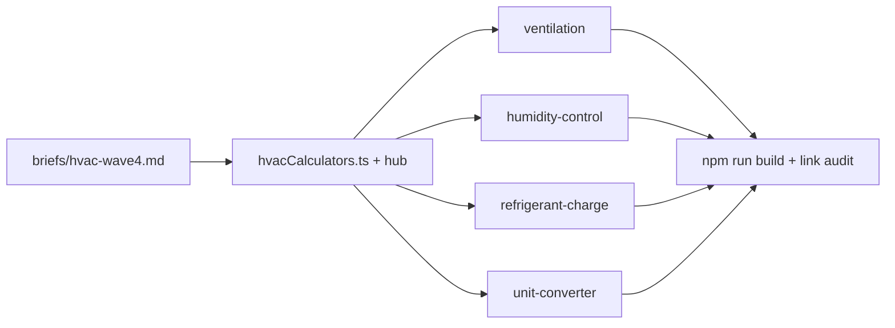

# HVAC Wave 4 — P3 Calculator Pages

## Goal

Build the four deferred P3 tools identified in [hvac_remaining_calculators_d5a032a5.plan.md](.cursor/plans/hvac_remaining_calculators_d5a032a5.plan.md), completing competitor coverage vs FieldPad / HVACPlanner / Calciator (excluding out-of-scope Manual J and Electrical).

**21 → 25 registered tools** in [`src/config/hvacCalculators.ts`](src/config/hvacCalculators.ts), [`src/config/calculatorCategories.ts`](src/config/calculatorCategories.ts) (`toolCount: 25`), and [`src/pages/calculators/hvac/index.astro`](src/pages/calculators/hvac/index.astro) (badge, meta, ItemList, hero copy).



---

## Step 1 — Write `briefs/hvac-wave4.md`

Copy structure from [briefs/hvac-wave3.md](briefs/hvac-wave3.md). One `### Calculator:` block per slug with formula, inputs, `DEFAULTS_RESULT`, 6–7 FAQs, sources, 4 related links, and CTA headline.

### 1. `hvac-ventilation-calculator` (accent: `teal`)

**Purpose:** Dedicated ASHRAE ventilation sizing — distinct from room ACH in the CFM calculator.

**Dual mode:**

| Mode | Formula | Default → result |
|------|---------|----------------|
| **Residential (ASHRAE 62.2)** | `CFM = 0.03 × floor_area + 7.5 × (bedrooms + 1)` | 2,000 sq ft, 3 bed → **90 CFM** |
| **Commercial (ASHRAE 62.1 simplified)** | `CFM = occupants × cfm/person + area × cfm/sqft` | 10 people @ 17.5, 1,500 sq ft @ 0.06 → **265 CFM** |

**Inputs:** `vent-mode` · `vent-area` · `vent-bedrooms` · `vent-occupants` · `vent-cfm-person` · `vent-cfm-sqft`

**Sources:** ASHRAE 62.1 (commercial ventilation) · ASHRAE 62.2 (residential whole-building ventilation)

**Related:** CFM, dew-point, sensible-latent-heat, duct-size

---

### 2. `hvac-humidity-control-calculator` (accent: `rose`)

**Purpose:** Size humidifier or dehumidifier capacity from moisture load.

**Dual mode:**

| Mode | Formula | Default → result |
|------|---------|----------------|
| **Dehumidify** | `Qs_lat = 0.68 × CFM × Δgrains`; `CFM = volume × ACH ÷ 60`; `pints/day ≈ Qs_lat × 24 ÷ 12,000` | 1,600 cu ft vol, 5 ACH, 110→75 grains → **~28 pints/day** |
| **Humidify** | Same latent formula for grains to add | 2,000 sq ft × 8 ft, 4 ACH, 25→35% RH band via grains → **~0.5–1.0 gal/day** (use grain delta from RH targets) |

Use indoor dry-bulb + RH selects to derive grains (reuse Magnus logic from [`hvac-dew-point-calculator.ts`](src/scripts/calculators/hvac-dew-point-calculator.ts)) rather than asking users for grains directly.

**Inputs:** `hc-mode` · `hc-area` · `hc-ceiling` · `hc-ach` · `hc-db` · `hc-rh-current` · `hc-rh-target`

**Sources:** ASHRAE Fundamentals (latent heat) · AHRI dehumidifier/humidifier sizing guidance

**Related:** dew-point, sensible-latent-heat, cfm, delta-t

---

### 3. `hvac-refrigerant-charge-calculator` (accent: `orange`)

**Purpose:** Line-set add-on charge beyond factory allowance (FieldPad / HVACPlanner pattern).

**Formula:**

```
extra_length = max(0, total_line_length − factory_allowance)
add_on_oz = extra_length × oz_per_foot(refrigerant, liquid_dia, suction_dia)
```

**Reference table (R-410A oz/ft beyond factory charge):**

| Liquid | Suction | oz/ft |
|--------|---------|-------|
| 1/4" | 1/2" | 0.43 |
| 3/8" | 5/8" | 0.78 |
| 3/8" | 3/4" | 0.98 |
| 1/2" | 7/8" | 1.25 |

**Defaults:** R-410A · 3/8 + 3/4 · 50 ft total · 15 ft included → **34 oz** (35 × 0.98)

**Inputs:** `rc-refrigerant` · `rc-liquid` · `rc-suction` · `rc-length` · `rc-included`

**Sources:** Carrier/Trane line-set charging tables · AHRI · manufacturer install guides

**Related:** superheat, subcooling, target-superheat, delta-t

---

### 4. `hvac-unit-converter` (accent: `sky`)

**Purpose:** Quick field conversions (FieldPad utility tool).

**Tri-mode (no cross-mode math — independent converters):**

| Mode | Conversions | Default → result |
|------|-------------|----------------|
| **Capacity** | `BTU/h = tons × 12,000`; `kW = BTU/h ÷ 3,412` | 3 tons → **36,000 BTU/h · 10.6 kW** |
| **Temperature** | `°C = (°F − 32) × 5/9` (bidirectional) | 75°F → **24°C** |
| **Pressure** | `Pa = in.w.c. × 249`; `kPa = PSI × 6.895` | 0.5 in.w.c. → **124 Pa** |

**Inputs:** `uc-mode` · `uc-value` · `uc-direction` (where bidirectional)

**Sources:** ASHRAE / IAPWS unit definitions · ACCA Manual D (static pressure units)

**Related:** tonnage, btu, static-pressure, cfm

---

## Step 2 — Batch config + hub update (Prompt 01 equivalent)

Edit these files once before generating pages:

### [`src/config/hvacCalculators.ts`](src/config/hvacCalculators.ts)

Add 4 entries to `hvacCalculators[]` (group logically):

- After fan-laws cluster: **ventilation**, **humidity-control**
- After charge cluster: **refrigerant-charge**
- Near sizing utilities: **unit-converter** (after tonnage or at end of sizing block)

Add 4 rows to `hvacCalculatorGuide[]` with plain-English rules.

Update `hvacFaqs`:

- "All twenty-one" → **twenty-five**
- Extend "which calculator first?" with ventilation (after CFM) and charge add-on (after superheat/subcooling)

### [`src/config/calculatorCategories.ts`](src/config/calculatorCategories.ts)

- `toolCount: 25`
- Refresh HVAC `description` to mention ventilation, humidity control, refrigerant charge, unit converter

### [`src/pages/calculators/hvac/index.astro`](src/pages/calculators/hvac/index.astro)

- Update `title`/`description`, OG/Twitter, badge ("25 Free Calculators"), hero paragraph
- ItemList auto-updates via `hvacCalculators.map` — no manual list edit needed

---

## Step 3 — Generate 4 pages + scripts (Prompt 02)

For each calculator, create exactly two files mirroring [`hvac-btu-calculator`](src/pages/calculators/hvac/hvac-btu-calculator/index.astro) + script (all four are `type: sizing`):

```
src/pages/calculators/hvac/<slug>/index.astro
src/scripts/calculators/<slug>.ts
```

**Suggested build order** (dependency / cross-link chain):

1. `hvac-ventilation-calculator`
2. `hvac-humidity-control-calculator` (may extract shared `grainsFromRh()` from dew-point script or duplicate the small Magnus helper inline — prefer inline duplicate to keep Prompt 02 scope isolated)
3. `hvac-refrigerant-charge-calculator`
4. `hvac-unit-converter`

Each page must include: canonical, OG/Twitter, 3 JSON-LD blocks, 6–7 FAQs matching schema, reference table where specified, 3 worked examples, sources line, 4 related calculator links to **existing** slugs.

---

## Step 4 — Cross-link existing pages (small, targeted edits)

Update related-calculator arrays or FAQ answers on sibling pages so the new tools are discoverable and no orphan links exist:

| Existing page | Add link to |
|---------------|-------------|
| [`hvac-cfm-calculator`](src/pages/calculators/hvac/hvac-cfm-calculator/index.astro) | ventilation (FAQ: "whole-building ventilation code") |
| [`hvac-dew-point-calculator`](src/pages/calculators/hvac/hvac-dew-point-calculator/index.astro) | humidity-control |
| [`hvac-sensible-latent-heat-calculator`](src/pages/calculators/hvac/hvac-sensible-latent-heat-calculator/index.astro) | humidity-control |
| [`hvac-superheat-calculator`](src/pages/calculators/hvac/hvac-superheat-calculator/index.astro) / subcooling | refrigerant-charge |
| [`hvac-tonnage-calculator`](src/pages/calculators/hvac/hvac-tonnage-calculator/index.astro) | unit-converter |

Keep edits to 1–2 links per page — no broad rewrites.

---

## Step 5 — Acceptance

Per [docs/calculator-prompts/README.md](docs/calculator-prompts/README.md):

- [ ] `npm run build` passes
- [ ] `toolCount === hvacCalculators.length === 25`
- [ ] Default inputs on each new page match `DEFAULTS_RESULT` in brief
- [ ] Reference-table / worked-example numbers match script output
- [ ] Grep all `/calculators/hvac/hvac-*` links — zero 404 targets
- [ ] FAQ JSON-LD mirrors visible FAQ on all 4 new pages

---

## Out of scope (unchanged)

- Manual J full load calc
- Electrical tools (capacitor, voltage drop) — future Electrical category
- Refactoring `CalculatorToolCard` (already generalized for HVAC)

## File summary

| Action | File |
|--------|------|
| Create | `briefs/hvac-wave4.md` |
| Create | 4 × `index.astro` + 4 × `.ts` script |
| Edit | `src/config/hvacCalculators.ts` |
| Edit | `src/config/calculatorCategories.ts` |
| Edit | `src/pages/calculators/hvac/index.astro` |
| Edit | ~5 existing calculator pages (cross-links only) |
