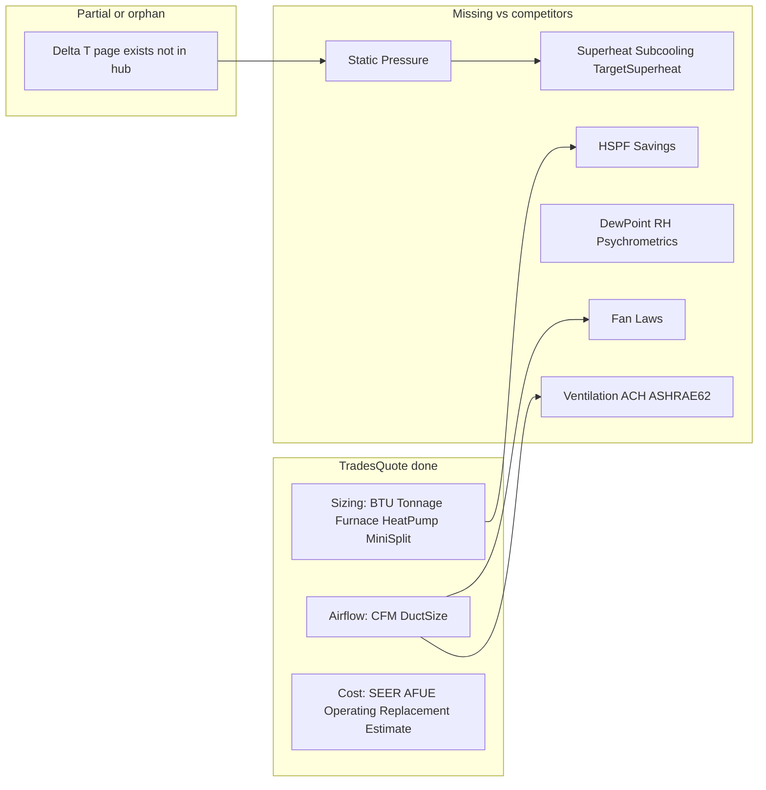

# HVAC Remaining Calculator Pages

## Current state (repo audit)

### Original wave — complete (12/12)

All entries in [`src/config/hvacCalculators.ts`](src/config/hvacCalculators.ts) have matching pages + scripts:

| Slug | Status |
|------|--------|
| `hvac-btu-calculator` | page + script |
| `hvac-tonnage-calculator` | page + script |
| `hvac-furnace-btu-calculator` | page + script |
| `hvac-heat-pump-calculator` | page + script |
| `hvac-mini-split-calculator` | page + script |
| `hvac-cfm-calculator` | page + script |
| `hvac-duct-size-calculator` | page + script |
| `hvac-seer-savings-calculator` | page + script |
| `hvac-afue-savings-calculator` | page + script |
| `hvac-operating-cost-calculator` | page + script |
| `hvac-replacement-cost-calculator` | page + script |
| `hvac-estimate-calculator` | page + script |

Hub ([`src/pages/calculators/hvac/index.astro`](src/pages/calculators/hvac/index.astro)) and [`src/config/calculatorCategories.ts`](src/config/calculatorCategories.ts) both say **toolCount: 12**.

### Orphan page — built but not registered

| Slug | Page | Script | In config/hub |
|------|------|--------|---------------|
| `hvac-delta-t-calculator` | yes | yes | **no** |

This page is live at `/calculators/hvac/hvac-delta-t-calculator` but invisible on the hub and omitted from `hvacCalculators[]`.

### Broken internal link (only one)

[`hvac-delta-t-calculator/index.astro`](src/pages/calculators/hvac/hvac-delta-t-calculator/index.astro) links to:

```
/calculators/hvac/hvac-static-pressure-calculator  → 404 (no page)
```

All other `/calculators/hvac/*` links across the 13 pages resolve to existing routes.

---

## What the docs say

Per [`docs/calculator-prompts/README.md`](docs/calculator-prompts/README.md):

1. Fill a **category brief** ([`category-brief.template.md`](docs/calculator-prompts/category-brief.template.md)) — one block per calculator with formula, inputs, defaults, FAQs, sources.
2. Run **Prompt 01** once to update config + hub ([`01-generate-category-hub.prompt.md`](docs/calculator-prompts/01-generate-category-hub.prompt.md)).
3. Run **Prompt 02** per calculator ([`02-generate-calculator-page.prompt.md`](docs/calculator-prompts/02-generate-calculator-page.prompt.md)).

There is **no HVAC brief file** in the repo (`briefs/` does not exist). The original 12 were the planned scope; Delta T appears to be the start of an undocumented **second wave** (technician/diagnostic tools).

---

## Gap analysis vs web sources

Compared against common free HVAC tool sets ([FieldPad](https://fieldpadpro.com/tools/), [HVACPlanner](https://hvacplanner.com/calculators), [Calcimator](https://calcimator.com/calculators/hvac), [AskHVAC.ca](https://askhvac.ca/)):



### Coverage matrix

| Tool | TradesQuote | FieldPad | HVACPlanner | Priority |
|------|-------------|----------|-------------|----------|
| BTU / load estimate | yes | yes | yes | — |
| Tonnage / AC sizing | yes | yes | yes | — |
| Furnace sizing | yes | temp-rise overlap | yes | — |
| Heat pump / mini-split | yes | — | yes | — |
| CFM / duct sizing | yes | yes | yes | — |
| SEER / AFUE / operating / replacement / estimate | yes | partial | yes | — |
| **Delta T** | page only | yes | — | **wire into hub** |
| **Static pressure (TESP)** | **404 link** | yes | yes | **P0 — fix broken link** |
| Superheat | — | yes | via refrigerant | P1 |
| Subcooling | — | yes | via refrigerant | P1 |
| Target superheat (fixed orifice) | — | yes | — | P1 |
| **HSPF savings** | gap (SEER+AFUE exist) | — | yes | P1 |
| Dew point / RH | — | yes | yes | P2 |
| Sensible & latent heat (SHR) | — | yes | coil perf | P2 |
| Fan laws | — | yes | yes | P2 |
| Ventilation / ACH / ASHRAE 62.1 | partial in CFM | — | yes | P2 |
| Humidifier/dehumidifier sizing | — | — | yes | P3 |
| Refrigerant line-set charge | — | yes | yes | P3 |
| HVAC unit converter | — | yes | — | P3 |
| Manual J (full load calc) | — | — | Calcimator | skip (engineering-grade, out of scope) |
| Electrical (capacitor, voltage drop) | — | yes | yes | defer to future **Electrical** category |

---

## Recommended remaining pages (prioritized)

### P0 — Fix now (1 page + config wiring)

1. **`hvac-static-pressure-calculator`**
   - **Why:** Only dangling link on the site; natural follow-on from Delta T (“diagnose airflow restriction behind a high split”).
   - **Formula (from competitors):** TESP = supply static + \|return static\|; compare to equipment max (typically 0.5–0.8 in. w.c.).
   - **Sources:** ACCA Manual D, manufacturer nameplate TESP ratings, ENERGY STAR QI.
   - **Type:** sizing (mirror [`hvac-cfm-calculator`](src/pages/calculators/hvac/hvac-cfm-calculator/index.astro)).

2. **Register `hvac-delta-t-calculator` in config**
   - Add entry to `hvacCalculators[]`, `hvacCalculatorGuide[]`, update hub copy, bump `toolCount` to **14** after static pressure is added (13 if static pressure deferred).
   - Update hub FAQ (“All twelve…” → correct count).

### P1 — Second wave cluster (4 pages)

These match the **refrigeration/airflow diagnostic** cluster every major competitor offers and extend the Delta T → Static Pressure → Charge workflow:

3. **`hvac-superheat-calculator`** — measured superheat = suction line temp − saturation temp; TXV vs piston guidance.
4. **`hvac-subcooling-calculator`** — measured subcooling = saturation temp − liquid line temp; TXV charging targets.
5. **`hvac-target-superheat-calculator`** — fixed-orifice target from indoor wet-bulb + outdoor dry-bulb (FieldPad pattern).
6. **`hvac-hspf-savings-calculator`** — mirror [`hvac-seer-savings-calculator`](src/pages/calculators/hvac/hvac-seer-savings-calculator/index.astro) for heat-pump heating (`% saved = 1 − oldHSPF ÷ newHSPF`); fills gap called out in SEER/AFUE/operating-cost FAQ copy.

### P2 — Psychrometrics & airflow depth (3 pages)

7. **`hvac-dew-point-calculator`** — dew point / RH from dry-bulb + RH (or inverse); condensation risk flags.
8. **`hvac-sensible-latent-heat-calculator`** — BTU/h from CFM × ΔT (sensible) + CFM × Δgrains (latent); SHR.
9. **`hvac-fan-laws-calculator`** — affinity laws: CFM₂/CFM₁ = RPM₂/RPM₁, SP ∝ RPM², BHP ∝ RPM³.

### P3 — Optional / lower SEO fit (defer unless brief expands)

- `hvac-ventilation-calculator` (ASHRAE 62.1 CFM/person or CFM/sq ft)
- `hvac-humidity-control-calculator` (humidifier/dehumidifier load)
- `hvac-refrigerant-charge-calculator` (line-set add-on charge by diameter/length)
- `hvac-unit-converter` (tons/BTU/kW, °F/°C, PSI/kPa)

---

## Implementation workflow (per docs)

For each new calculator:

1. **Write brief blocks** — copy [`category-brief.template.md`](docs/calculator-prompts/category-brief.template.md) → `briefs/hvac-wave2.md` with one `### Calculator:` block per slug (formula, inputs, `DEFAULTS_RESULT`, FAQs, sources, related links).
2. **Batch config update** — run Prompt 01 (or manually edit) to add all new slugs to [`hvacCalculators.ts`](src/config/hvacCalculators.ts), guide table, hub meta, and `toolCount`.
3. **Generate pages** — run Prompt 02 once per slug (parallelizable); each produces:
   - `src/pages/calculators/hvac/<slug>/index.astro`
   - `src/scripts/calculators/<slug>.ts`
4. **Acceptance** — per docs checklist: `npm run build`, no dangling links, FAQ JSON-LD matches on-page FAQ, default inputs match worked examples.

Suggested generation order (dependency chain):

```
Delta T (wire config) → Static Pressure → Superheat + Subcooling + Target Superheat → HSPF Savings
```

Cross-link the diagnostic cluster: Delta T ↔ Static Pressure ↔ Superheat ↔ Subcooling ↔ CFM.

---

## Summary

| Category | Count |
|----------|-------|
| Original 12 (config) | **done** |
| Orphan (Delta T) | **needs hub/config registration** |
| Broken link target | **1 page** (`hvac-static-pressure-calculator`) |
| Recommended wave 2 (P1) | **4 pages** (superheat, subcooling, target superheat, HSPF savings) |
| Optional wave 3 (P2–P3) | **3–7 pages** (psychrometrics, fan laws, ventilation, etc.) |

**Minimum to clear all gaps and broken links:** register Delta T + build Static Pressure (2 config edits, 1 new page).

**Competitive parity for field-tech SEO cluster:** add the 4 P1 refrigerant/charge tools + HSPF savings (5 new pages), bringing HVAC from 12 → **18** registered tools.
